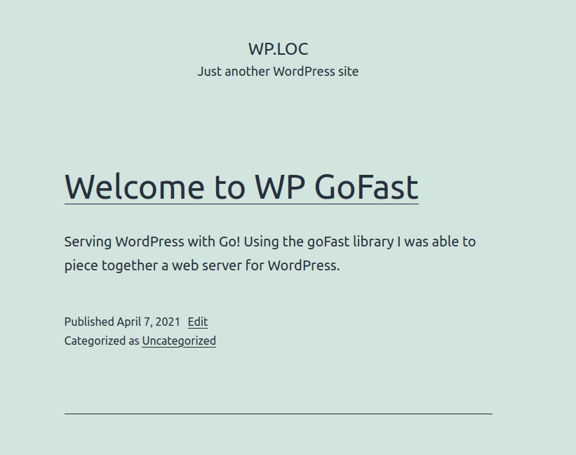

# wp-gofast

Serving WordPress with Go! 

Use at your own risk! :) 

Currently this is just a rough proof of concept, I took a (procrastination) 
break from studying to see if this might be possible. I've been fascinated 
with the idea of using Go as the web server for WordPress; I keep searching 
every once in a while, in hopes that someone else might have put something 
together. Although as I'm writing this, I just stumbled across 
[RoadRunner](https://github.com/spiral/roadrunner). It doesn't look like 
it is currently compatible with WordPress though.

Anyway, I would like to implement this project differently in the future. As 
it is now it starts two webservers, the one in front filters static files and 
serves those while passing any PHP requests to the "backend" server that talks 
to the FastCGI socket.

Initially I started with [fcgi_client](https://github.com/tomasen/fcgi_client) 
but I decided I didn't want to procrastinate that much. I would like to go 
back to using this or a library like in order to call the socket directly 
instead of passing to another server to do so.

One thing is for sure! It certainly has some bugs that need to be ironed out.

## Acknowledgments

 - [gofast](https://github.com/yookoala/gofast) FastCGI "client" library
 - [spf13 viper](https://github.com/spf13/viper)
